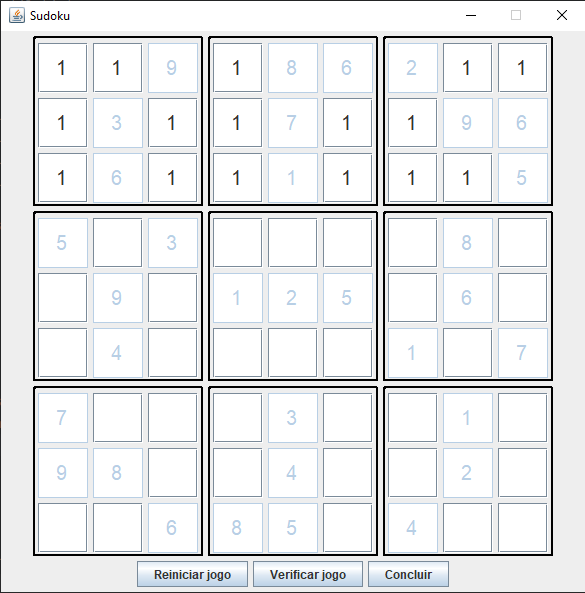

# SudokuDIO


## 📌 Sobre o Projeto

Este projeto foi desenvolvido durante as aulas do curso **"Bradesco - Java Cloud Native"** da [Digital Innovation One (Dio.me)](https://www.dio.me), no módulo de **Programação Orientada a Objetos**. Ele demonstra a aplicação dos conceitos de **OOP** na construção de um jogo interativo com **interface gráfica usando Java Swing**.

## 🚀 Tecnologias Utilizadas

- **Java 17**
- **Swing** para a interface gráfica
- **Paradigma Orientado a Objetos (OOP)**
- **Tratamento de eventos e interface interativa**

## 🎮 Funcionalidades

✔️ Interface gráfica intuitiva para jogar Sudoku  
✔️ Validação automática dos números inseridos  
✔️ Verificação da solução do jogo  
✔️ Opção para reiniciar o jogo  

## ▶️ Como Executar

### 1️⃣ Clone o Repositório
```sh
git clone https://github.com/RuanPablo2/SudokuDIO
```

### 2️⃣ Execute a Aplicação
Passe o Sudoku no argumento ao rodar o programa:
```sh
java -jar sudoku.jar "0,0;4,false 1,0;7,false 2,0;9,true 3,0;5,false 4,0;8,true 5,0;6,true 6,0;2,true 7,0;3,false 8,0;1,false 0,1;1,false 1,1;3,true 2,1;5,false 3,1;4,false 4,1;7,true 5,1;2,false 6,1;8,false 7,1;9,true 8,1;6,true 0,2;2,false 1,2;6,true 2,2;8,false 3,2;9,false 4,2;1,true 5,2;3,false 6,2;7,false 7,2;4,false 8,2;5,true 0,3;5,true 1,3;1,false 2,3;3,true 3,3;7,false 4,3;6,false 5,3;4,false 6,3;9,false 7,3;8,true 8,3;2,false 0,4;8,false 1,4;9,true 2,4;7,false 3,4;1,true 4,4;2,true 5,4;5,true 6,4;3,false 7,4;6,true 8,4;4,false 0,5;6,false 1,5;4,true 2,5;2,false 3,5;3,false 4,5;9,false 5,5;8,false 6,5;1,true 7,5;5,false 8,5;7,true 0,6;7,true 1,6;5,false 2,6;4,false 3,6;2,false 4,6;3,true 5,6;9,false 6,6;6,false 7,6;1,true 8,6;8,false 0,7;9,true 1,7;8,true 2,7;1,false 3,7;6,false 4,7;4,true 5,7;7,false 6,7;5,false 7,7;2,true 8,7;3,false 0,8;3,false 1,8;2,false 2,8;6,true 3,8;8,true 4,8;5,true 5,8;1,false 6,8;4,true 7,8;7,false 8,8;9,false"
```

> 📝 **Nota:** Você pode substituir a string do Sudoku por qualquer outro tabuleiro válido.

🚀 *Divirta-se jogando Sudoku!* 🎯